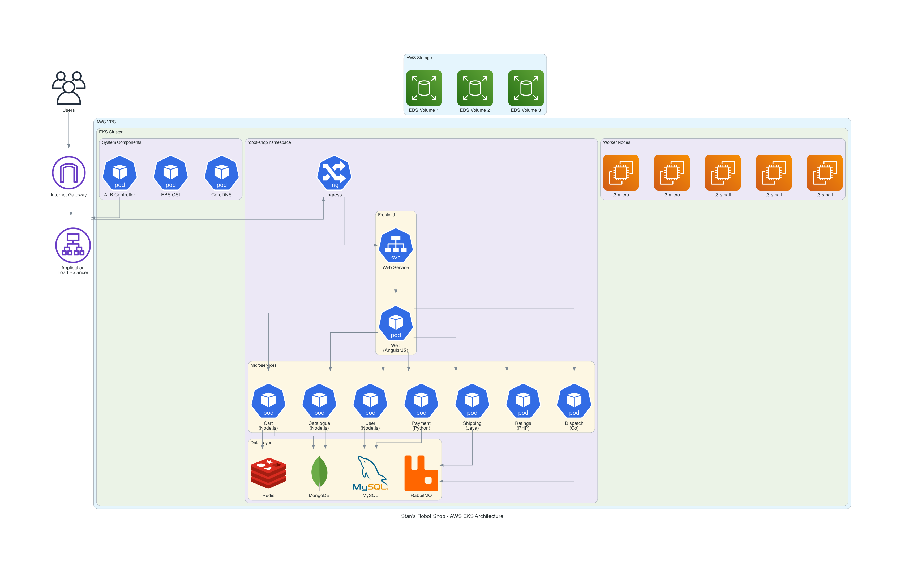
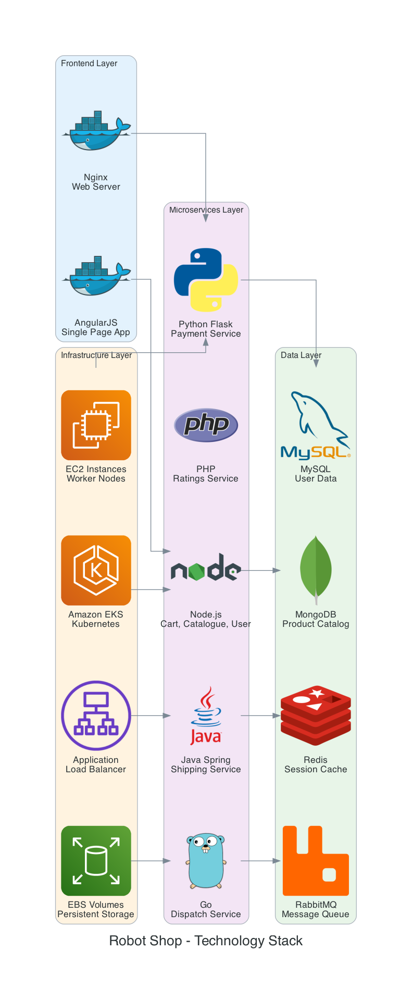
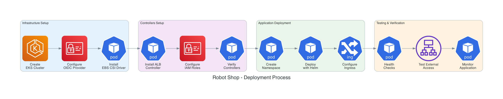

# 🏪 Stan's Robot Shop - Production EKS Deployment

[](https://aws.amazon.com/eks/)
[](https://kubernetes.io/)
[](https://helm.sh/)
[](LICENSE)

A production-ready deployment of Stan's Robot Shop microservices application on AWS EKS, demonstrating enterprise DevOps practices and cloud-native architecture.

## 🏗️ Architecture Overview



*Complete microservices architecture deployed on AWS EKS with 12 services, multiple databases, and production-ready infrastructure.*

## 🚀 Quick Start

### Prerequisites
- AWS CLI configured with appropriate permissions
- kubectl installed and configured
- eksctl installed
- Helm 3.x installed

### Deploy the Application

```bash
# 1. Create EKS cluster
eksctl create cluster \
  --name robot-shop-cluster \
  --region us-east-1 \
  --nodegroup-name workers \
  --node-type t3.small \
  --nodes 3 \
  --managed

# 2. Configure OIDC provider
eksctl utils associate-iam-oidc-provider \
  --cluster robot-shop-cluster \
  --approve

# 3. Install EBS CSI driver
eksctl create iamserviceaccount \
  --name ebs-csi-controller-sa \
  --namespace kube-system \
  --cluster robot-shop-cluster \
  --role-name AmazonEKS_EBS_CSI_DriverRole \
  --role-only \
  --attach-policy-arn arn:aws:iam::aws:policy/service-role/AmazonEBSCSIDriverPolicy \
  --approve

eksctl create addon --name aws-ebs-csi-driver \
  --cluster robot-shop-cluster \
  --service-account-role-arn arn:aws:iam::<ACCOUNT-ID>:role/AmazonEKS_EBS_CSI_DriverRole \
  --force

# 4. Install AWS Load Balancer Controller
curl -O https://raw.githubusercontent.com/kubernetes-sigs/aws-load-balancer-controller/v2.11.0/docs/install/iam_policy.json

aws iam create-policy \
  --policy-name AWSLoadBalancerControllerIAMPolicy \
  --policy-document file://iam_policy.json

eksctl create iamserviceaccount \
  --cluster=robot-shop-cluster \
  --namespace=kube-system \
  --name=aws-load-balancer-controller \
  --role-name AmazonEKSLoadBalancerControllerRole \
  --attach-policy-arn=arn:aws:iam::<ACCOUNT-ID>:policy/AWSLoadBalancerControllerIAMPolicy \
  --approve

helm repo add eks https://aws.github.io/eks-charts
helm repo update eks

VPC_ID=$(aws eks describe-cluster --name robot-shop-cluster --query "cluster.resourcesVpcConfig.vpcId" --output text)

helm install aws-load-balancer-controller eks/aws-load-balancer-controller \
  -n kube-system \
  --set clusterName=robot-shop-cluster \
  --set serviceAccount.create=false \
  --set serviceAccount.name=aws-load-balancer-controller \
  --set region=us-east-1 \
  --set vpcId=$VPC_ID

# 5. Deploy Robot Shop
kubectl create namespace robot-shop
cd EKS/helm
helm install robot-shop --namespace robot-shop .

# 6. Configure external access
kubectl apply -f ingress.yaml
```

## 🔍 Verification

```bash
# Check cluster status
kubectl get nodes

# Check application pods
kubectl get pods -n robot-shop

# Check services
kubectl get svc -n robot-shop

# Check ingress
kubectl get ingress -n robot-shop

# Get application URL
kubectl get ingress -n robot-shop -o jsonpath='{.items[0].status.loadBalancer.ingress[0].hostname}'
```

## 🛠️ Technology Stack



### Application Services
- **Frontend**: AngularJS, Nginx
- **Backend**: Node.js, Java (Spring Boot), Python (Flask), Go, PHP
- **Databases**: MongoDB, MySQL, Redis, RabbitMQ

### Infrastructure
- **Container Orchestration**: Amazon EKS (Kubernetes 1.30)
- **Compute**: EC2 instances (t3.small)
- **Load Balancing**: Application Load Balancer
- **Storage**: EBS volumes (gp3)
- **Networking**: VPC, Security Groups
- **Security**: IAM roles, OIDC integration

## 📋 Deployment Process



The deployment follows a systematic approach:
1. **Infrastructure Setup** - EKS cluster and networking
2. **Security Configuration** - OIDC provider and IAM roles
3. **Storage Setup** - EBS CSI driver for persistent volumes
4. **Load Balancer** - ALB controller for external access
5. **Application Deployment** - Helm-based microservices deployment
6. **Verification** - Health checks and testing

## 🏪 Application Features

Once deployed, the Robot Shop includes:

- **Product Catalog** - Browse available robots and accessories
- **Shopping Cart** - Add/remove items, manage quantities
- **User Management** - Registration, login, profile management
- **Payment Processing** - Secure payment gateway integration
- **Order Management** - Order tracking and history
- **Shipping** - Delivery options and tracking
- **Reviews & Ratings** - Product feedback system

## 🔧 Troubleshooting

### Common Issues

**Pods in Pending State**
```bash
kubectl describe pods -n robot-shop
kubectl get events -n robot-shop --sort-by='.lastTimestamp'
```

**Load Balancer Issues**
```bash
kubectl logs -n kube-system deployment/aws-load-balancer-controller
kubectl describe ingress -n robot-shop
```

**Storage Issues**
```bash
kubectl get storageclass
kubectl get pv,pvc -n robot-shop
```

## 📊 Monitoring

The application includes built-in observability:
- **Health Checks** - Kubernetes liveness and readiness probes
- **Metrics** - Application and infrastructure metrics
- **Logging** - Centralized logging with CloudWatch
- **Tracing** - Distributed tracing with Instana

## 🔒 Security

Security best practices implemented:
- **No hardcoded credentials** - IAM roles and service accounts
- **Network segmentation** - VPC and security groups
- **RBAC** - Kubernetes role-based access control
- **Encryption** - Data encryption at rest and in transit

## 📈 Scaling

The deployment supports:
- **Horizontal Pod Autoscaling** - Scale pods based on CPU/memory
- **Cluster Autoscaling** - Scale nodes based on demand
- **Load Balancing** - Distribute traffic across healthy pods
- **Multi-AZ** - High availability across availability zones

## 🧹 Cleanup

To remove all resources:

```bash
# Delete the application
helm uninstall robot-shop -n robot-shop
kubectl delete namespace robot-shop

# Delete the cluster
eksctl delete cluster --name robot-shop-cluster --region us-east-1
```

## 📚 Documentation

Additional documentation and resources:

- **[Portfolio Materials](docs/portfolio/)** - README templates, blog posts, LinkedIn content
- **[Architecture Diagrams](docs/diagrams/)** - Visual representations of the system
- **[Deployment Guides](docs/guides/)** - Detailed implementation guides

## 🤝 Contributing

1. Fork the repository
2. Create a feature branch (`git checkout -b feature/amazing-feature`)
3. Commit your changes (`git commit -m 'Add amazing feature'`)
4. Push to the branch (`git push origin feature/amazing-feature`)
5. Open a Pull Request

## 📝 License

This project is licensed under the MIT License - see the [LICENSE](LICENSE) file for details.

## 🙏 Acknowledgments

- **Stan's Robot Shop** - Original application by Instana
- **AWS EKS Team** - For the excellent Kubernetes service
- **Kubernetes Community** - For the amazing ecosystem
- **Open Source Contributors** - For the tools and libraries used

---

**⭐ If this project helped you, please give it a star!**

*Built with ❤️ for the DevOps community*
